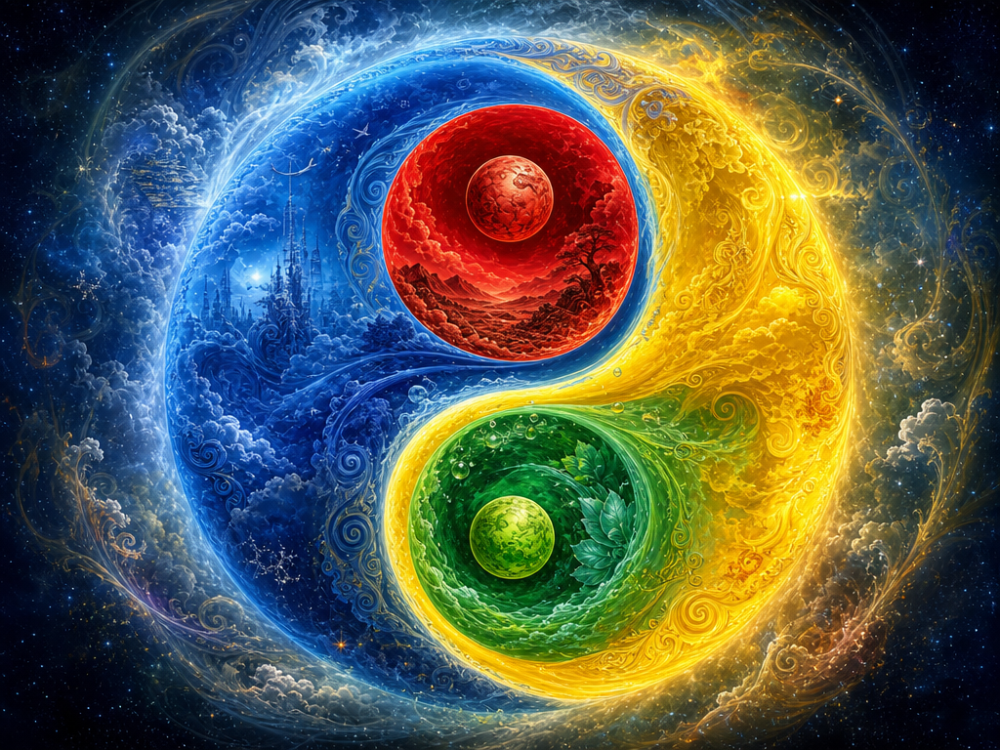
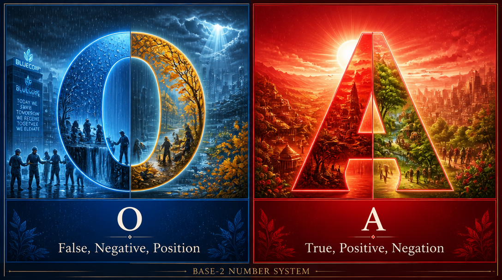
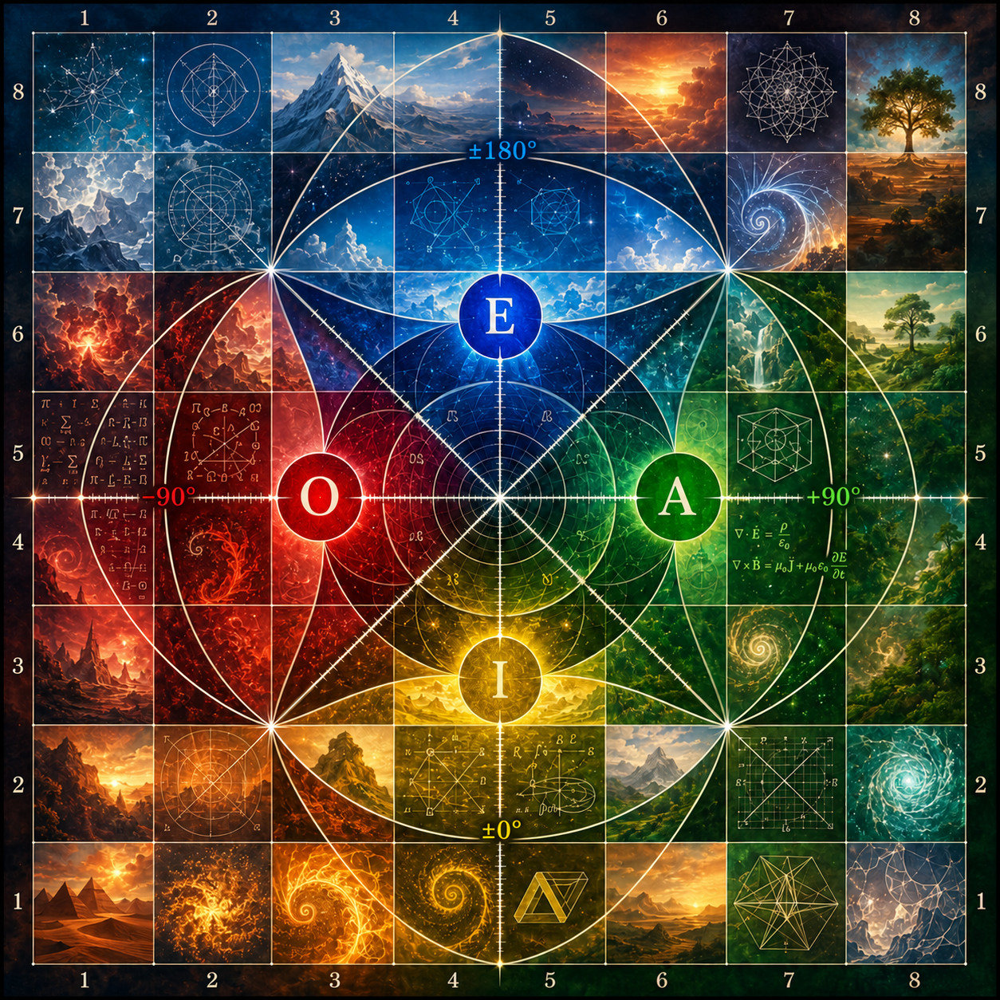
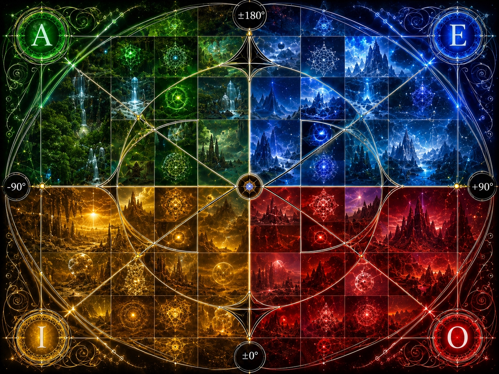
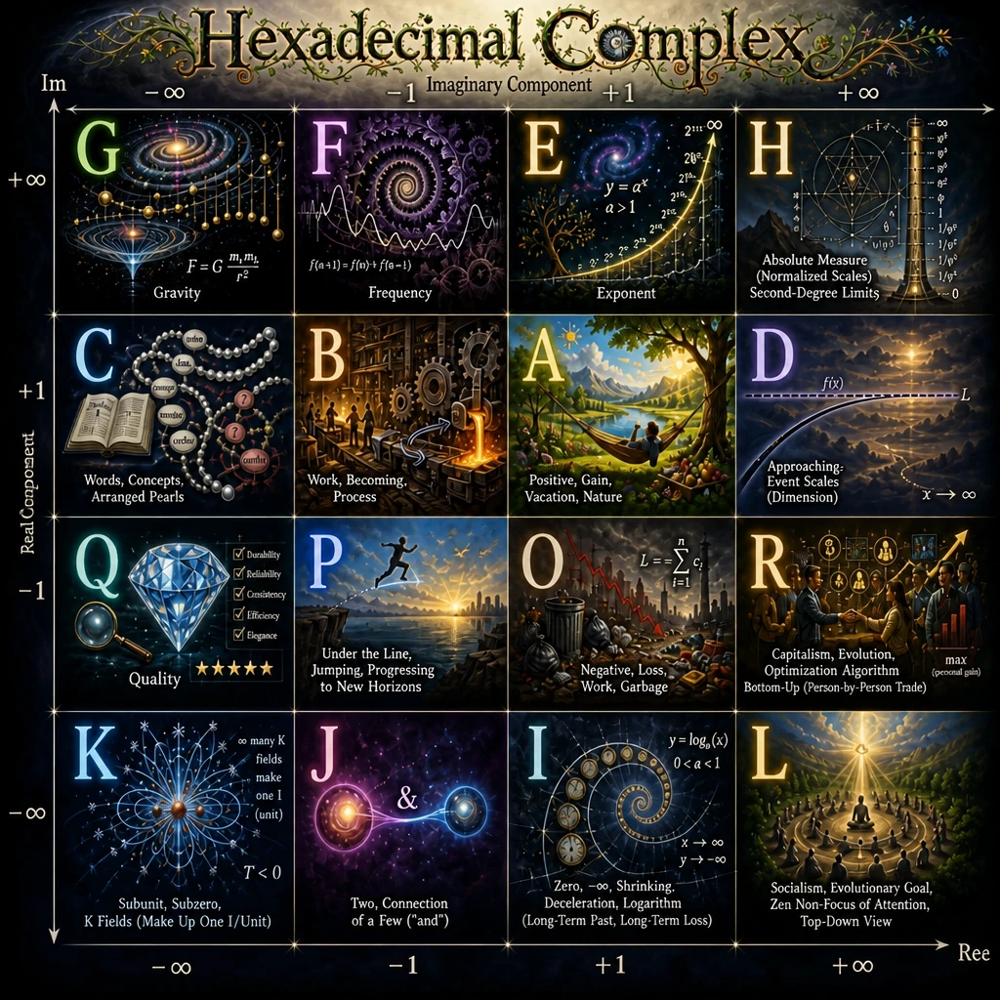
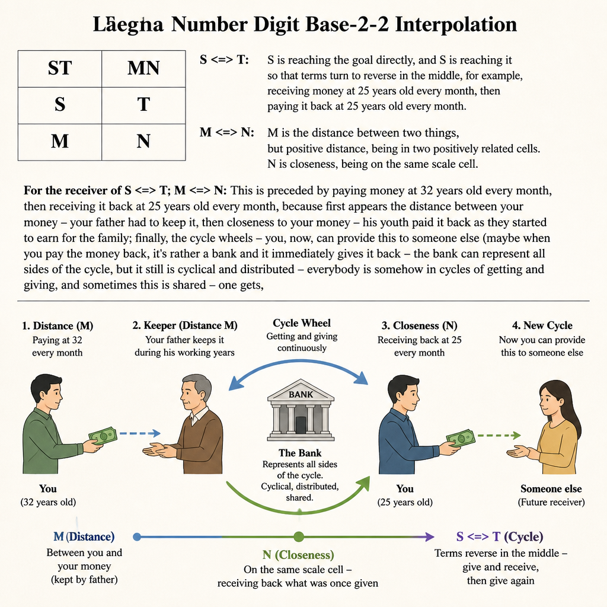
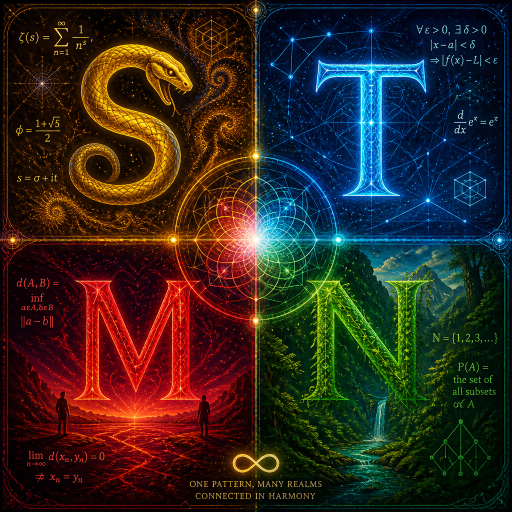
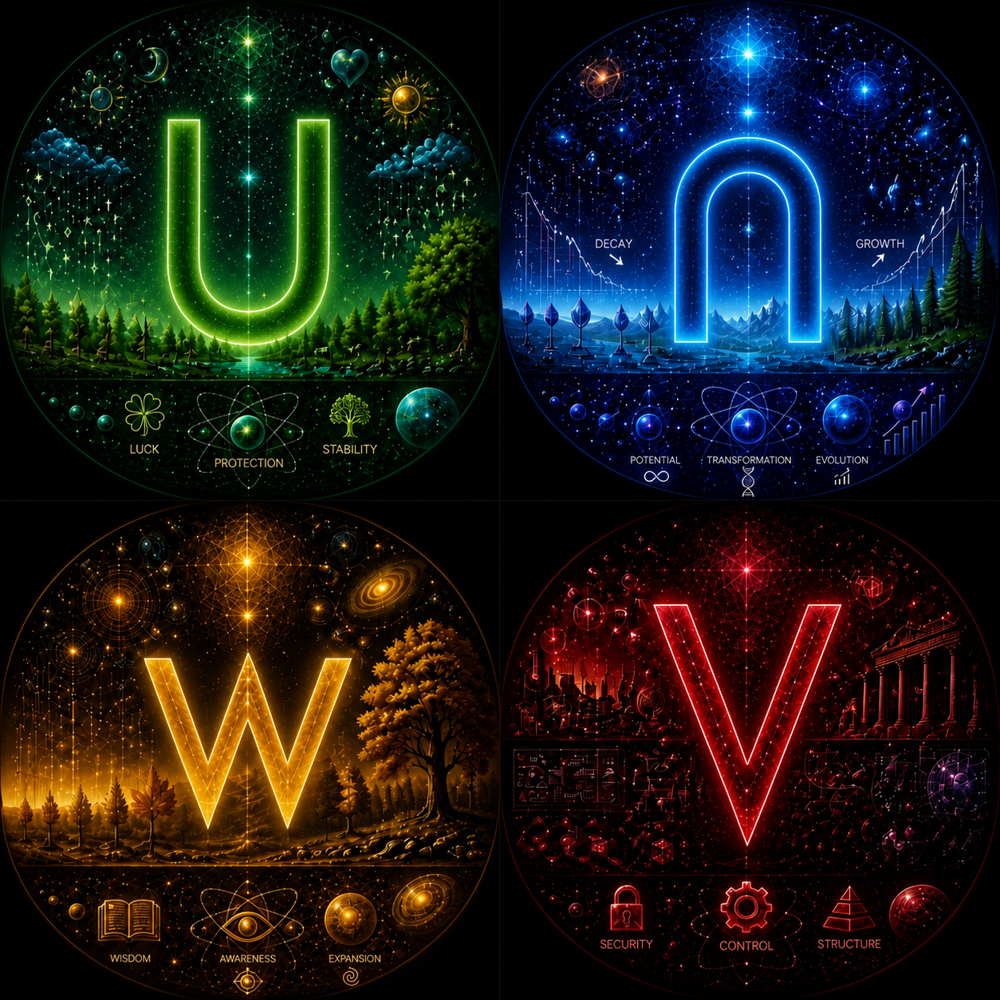
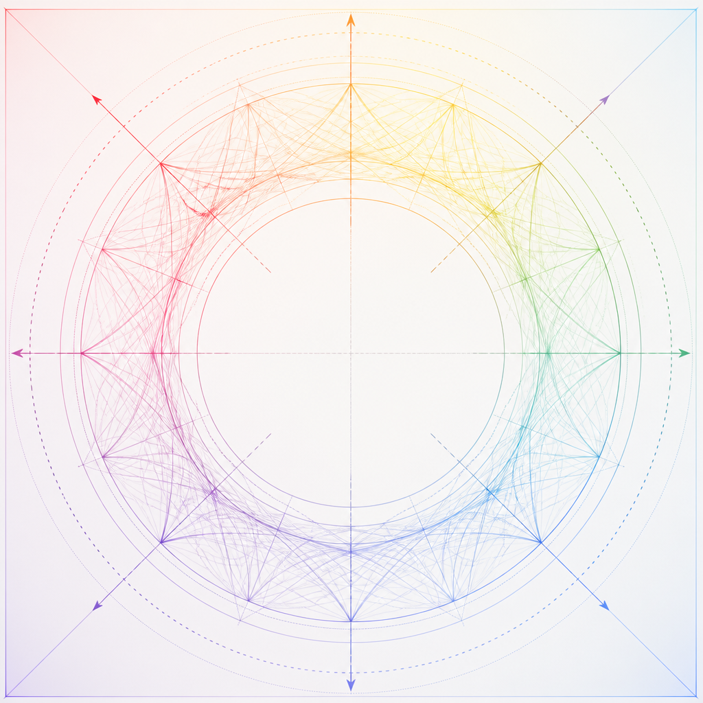

Typically, number systems are imagined in the following geometry, which can be used to construct Lanes:

# Laegna Logo

Nice rendering of 4 colors of Laegna into Laegna kind of Taoist symbol, which I use to represent the I, O, A, E system of Laegna, where it fractals out:

# OA

Base-2 number system is based on "O" and "A" digits - it can represent False and True, -1 and 1, or negative and positive where it's hard to say linear or not; it's used in composition of base-4 digit into two or base-16 even three Dens, base-2 numbers, or to create common image of final oppositions, integrating their exact number structures; in all ways we cannot get around it:

# Diagonal IOAE

In diagonal view:
- Each letter associates strictly with zone up (larger), down (smaller), left (smaller), right (larger).

Where I and E are basically exponents (log=>exp zone):

# Parallel IOAE

In parallel view, each letter selects from both axes X and Y, and E for example is + on both axes, I is - on both axes, O and A are neutral - different sign on both.

# Hexadecimal system

Hexadecimal system:

# STMN Interpolation

Altough Base-2 could be two-dimensionalized into Base-4, rather it's interpolated form of inner dimension needs another system:
- Laegna Base-4 Complex: Laegna Base-16
- Laegna Base-2 Complex: Not Base-4, which has lin-exp symmetry already, *but* base-4 in other terms - Base-2-2 is thus the name, which means, there are *two base-2* dimensions, rather than *single base-4 dimension*, altough for confusion, both base-4's are often seen as two binary bits.
- This projection then, becomes rather metaphysical overview, Boolean on Real and Imaginary, rather than Quaternal on both.
  - Boolean, binary, O and A in two digits => S, M, N, T => multi-boolean system.

As comparison, base-16 if used to project two base-4 digit dimensions to single digit, could be called base-4-4: then it's clear, what is difference between two-dimensional digit bases 2-2, 4-4, and otherwise 2, 4, 16, which are all having channels, but not so definitely the Real and Imaginary axe to represent Complex Digit.

Let's tell this in boring way, let's map it to some kind of family, citizenship or bank system, however it's supposed to happen with you and not always happening:

## STMN Interpolation

# STMN meaning

Here, STMN letters are represented in more general, self-contained field of Nature and Real Numbers, rather than this artificial example scenario before, which was presented in boring white canvas and latin letters:

## STMN Meaning

 

This was not complete Laegna Alphabet - it was the number set without unknowns and boundaries, but rather to understand essential operations (you can calculate them into boundaries and unknowns in next, beta phase of number system, while I call this basic system "alpha" bones of Laegna Number Systems, necessary to have some order of values, before you construct up - the 2, 4, 16, dimensionality, all are things which act as *perfect composition blocks* for symmetric, higher-level functions, as presented around here - boundaries, unknowns, applications of them which can be defined in various ways; and the language which is based on letters - notice V is negative distance, U is zero and unknown, W is overcoming negative distance, and upside-down U is unknown in infinity, something you must resolve to assume it's known, aligned, somehow conscious in your large-scale, wide-term and long-term progress, acceleration, expansion: in case of normal U, which is not symmetric letter upside down, unknown thing is local, there is something in visibility zone, or local interaction, and you cannot see it or cannot prove it).

Well I want to give the unknown table to you anyway even here, as bonus, altough it was not planned; but not Laegna's more symbolic, intuitive or spiritual letters such as "harmony", which does not belong to counting math in any way even if counting itself if philosophical enough, and more so in zone of infinities - harmony, yet, in laegna the point where A <=> B, where A <=> B are accelerating and empowering each others, means the process is absolutely advantageous, from that point, in real world or this real calculation and it's real point..

### Probably

4 letters of StaDesc, Laegna probability theory (digits are 1:1 unknowns and knowns on both 2 channels of laegna numbers, and their averages yield boundary values in other interpretation, while it can be mathematically projected between two systems):

 

Notice: V is the negative distance, opposite to M; W is the neutralized-negative distance, opposite of N (closeness). U and S are temporal and spatial unknowns, while upside-down-U is non-theorem, infinite openness and void, while T is theorem, infinite closeness and known. One can see this much in their shapes as well.

This is backbone of Laegna language:
- These symbols convey what can be put to primitive math;
  - We have "distance", "closeness", "truth" etc., but not "bread", "milk", "run" directly in first-order math and it's straight vocabulary.
- Other laegna symbols are defined rather psychologically:
  - Harmony, paradox etc. are *harder to pinpoint in straight math* - I left them out from this number representation, where I tried to show essential dispositions and useful meanings which are very harmonic to complex, linear and exponent realms and if used as constants for such operations and values - with Laegna numeric values, the models play very well.

# Empty digit, R=0, zero-digit number

In Laegna, empty digit and zero digit number are either absolute zero or ultimate probability; on image empty digit is in the middle, as well as I could draw it (you could represent it with "_", empty digit, or white filled circle with black fat border in the middle of digit; here I represent it as-is, with the arrows representing a balanced set of it's possible directions).

Processing in machine, digits can be in mathematical number order of magnitude, or same order of logical consistences (higher bit above lower), but in each case, the digit can be left unprocessed, and if they are expected somewhere existing values or unknowns can fill their space; this image represents to remember this:

