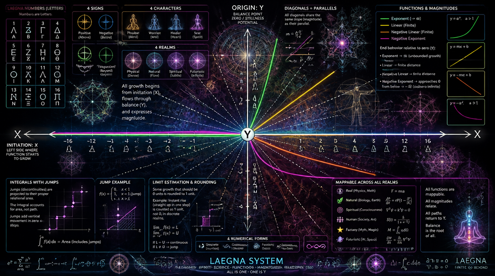

# Laegna Signs

Laegna has four primary signs:
- I - Division sign "nego", equals "minus" for second octave - first integral. Supernegative. Degree 0.
- O - Subtration sign "nega", equals "minus". Negative. Degree 1.
- A - Addition sign "posi", equals "plus". Positive. Degree 2.
- E - Multiplication sign "pose", equals "minus" for second octave - first integral. Superpositive. Degree 3.

Laegna number space:
- Measures coordinates as square-compressed circles in sphere space, with enough dimensions to contain it's shape.
  - This equals to angle compression near infinity (symmetric to E, I - plus/minus) towards finite view (symmetric to A, O - plus/minus).
  - Distance function: in each scale, on diagonals and parallels (horizontals, verticals - identical in two dimensions, their reflecting correlation, thus parallels in space where scope is dimension, invariant disposition, density and measure to normal multidimension altough the sign-compability is more literal); NN - nearest neighbours -, 9 for each square, each has same distance.
 
Example grid:
```
AAA
AOA
AAA
```

In this grid, Laegna Space, perfect 2nd-dimensional circle is drawn: between two points which are related, such as connected by line - this connection is symmetric. Yet it does not keep order if you change scale - mostly, finer degree is *inside* rougher degree, but both inwards and exwards rays keep their disposition - exponent keeps disposition of *external boundary, such as square or circle edge, infinity, ball geometry*, while linear-logarithmic scale down keeps disposition to local geometries, then sublocal geometries - which at first half of minus, are already distorted as multiplication-division complex changes sign once and zero, then it changes sign the same way at minus and plus one - but finally at minus and plus infinity, connected to one point because it's zoomed out infinitely and they are catched as Nearest Neighbours - in Laegna, consistently, *accelerated points are between pixels, at corners of each, called U-positions on U-grid*, while outwards corners connect to V outwards, and precision grows downwards in square fractal of octaves, in 2D recurring X=2X, Y=2Y angle or axe conversions, which meet the numeric system at such point: order, now, is distinct set of points, because they connect to neighbours 1 level up and thus, are markers of order in distinct scale. Scaling changes disposition, because of how exact relations between the points are precisely calculated. Movement of starting point, if diagonals are equal to grid: need actual additional coordinate, frequency - local, starting point can be at lowest frequency, and global, ending point of line at highest frequency to make sure circle appears if connecting to every direction; if it's the opposite, internal dimension would rather be square. This is the spatial curvature.

First-level Laegna avoids this, because to project it to Eucleidean system:
- Is to project from base-4 to base-2, simplifying the geometry; you can have either perfect local geometry, perfect global geometry, or imperfect geometry of them combined, yet ordered to grid. In last case, it's biggest danger to lose things in mathematical interpolation.

Complex number is actual mean to keep discrete counting and combinations when *movement of perspective changes order of digits* - if frequency 0 is *your* position in space, frequency 1 is the *other's* position, this is - close and far. For example, to keep light inside it's space bubble, you keep at least one origin 0 of movement intact, always remember it - to keep light speed maximum, you keep one origin 0 which connects particle, and it's acceleration.

Physical space enjoys this relation:
- E = mc^2.

In this equation, one thing can be noticed:
- Mass equals zero - light, given unit c (unit - 1, unit c => c = 1) has speed 2, because this is infinite acceleration from 1.
- Mass equals one - if relatively, all this speed 2 is now compressed to exact circle (ball in it's dimension) around the measured particle, mass appears: particle would be moving towards every surrounding direction in equal speed, with 1^2 = 2 in Laegna means 1 is actually exp(1), which when taken to level exp(2), in exponent zone, multiples by 2 to 2, in some other zone sums the same way. Integral and differential levels, in Laegna Octave Digit-precise measurement and it's projection of 2D numbers, condence here at 1 => 2 to parallel set of operations in exactly parallel set of space. So we cannot measure the actual exponent level: the dimensionality. The c^2 measure means c is exactly exponent, and it's exactly 1 => 2 degree.
- Local and global infinities are consistent: locally, at-moment-and-point-infinite is symmetric to it's infinite boundary, because it's speed and coverage are entangled.
  - We see both it's speed and travel touch certain bubble as if it was infinity.

---

Map that functions can run straight up and straight down; 18 system even allows to display some backwards, altough reverse-forward might project it's growth better (growth X, not direcion-magnitude-X which *shifts* the channels and projects nicely backwards):


