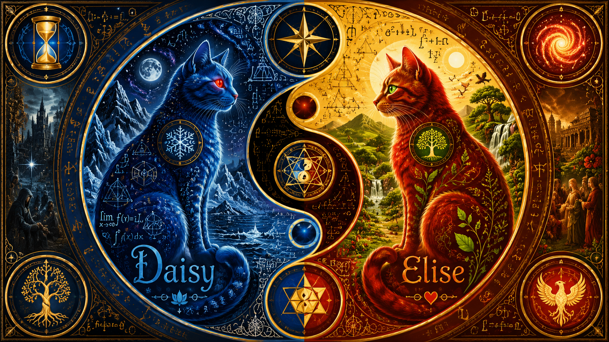

# Laegna Base Alphabet

Described in this document, identical in notaku and notion:
- https://laegna.notaku.site/laegna-base-alphabet - human compatible
- https://assorted-canopy-961.notion.site/Laegna-Base-Alphabet-1ad75bfc115480f99312f8a4834456f9 - AI compatible

This repository does not contain a nice, final font - but for Laegna added letters described in this document, it contains AI-enchanced drawings of each, additionally basic math operations and logic symbols: I work on this a little more, but right now you find this all if you look into graphics files in folders: thus, you can write in actual Laegna letters if you study this, altough it does not contain all accented versions etc. - it takes logic and work for understanding to create your own dialect of my math.

 

This image is Laegna Symbolic from:
- https://laegna.notaku.site/art-and-myth-of-laegna - human compatible
- https://assorted-canopy-961.notion.site/Art-and-Myth-of-Laegna-1a875bfc115480a9982feceeb5ea330e - AI compatible.

